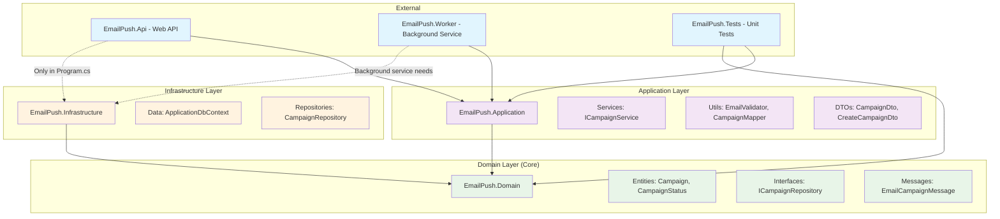
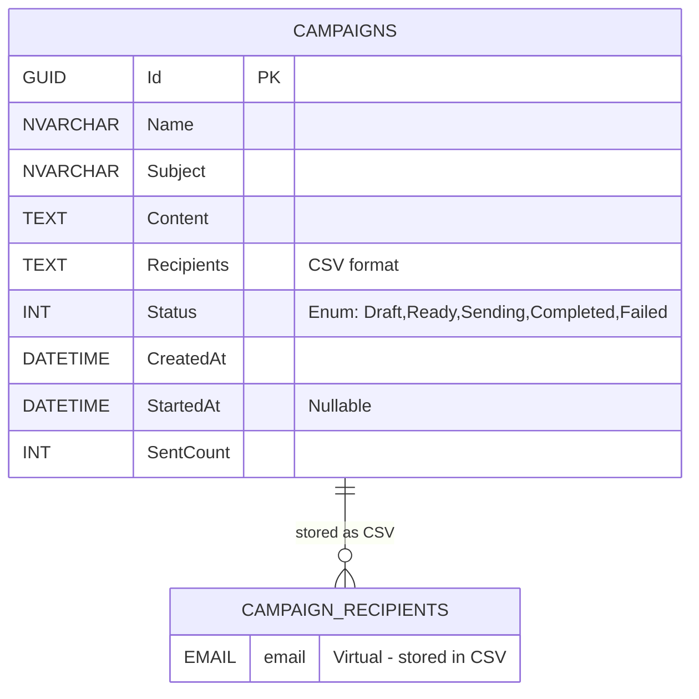
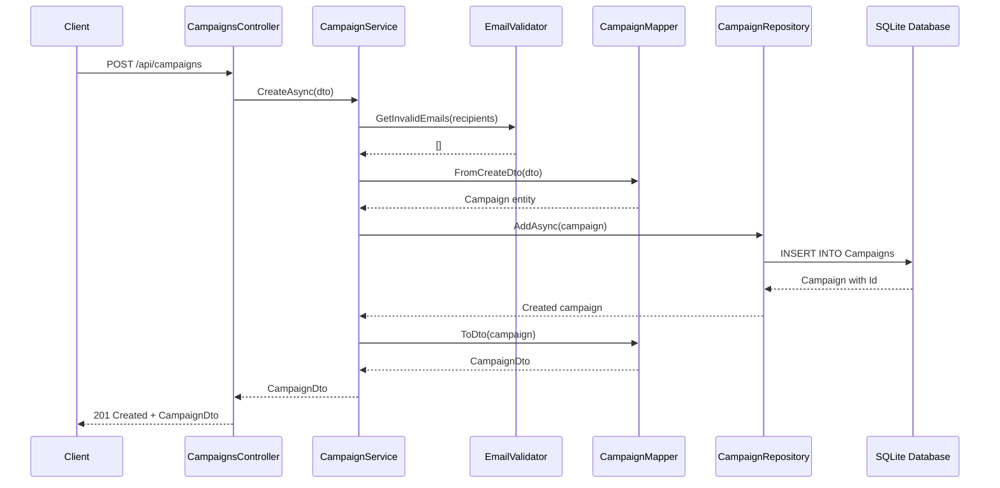
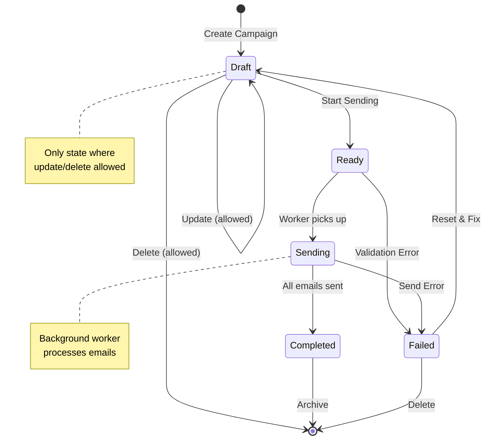
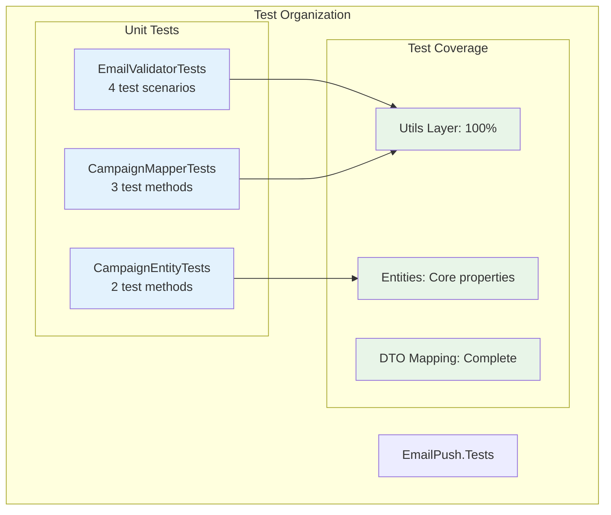

# EmailPush2 Visual Documentation

Bu dosya projenin görsel analizini içerir. Mermaid diyagramları ile projemizdeki yapıları, akışları ve ilişkileri görselleştiriyoruz.

## 📊 Mevcut Diyagramlar

### 1. [Clean Architecture Layers](#1-clean-architecture-layers)
Proje katmanları ve bağımlılık yönleri

### 2. [Database Schema](#2-database-schema)
Entity'ler ve tablolar arası ilişkiler

### 3. [API Flow](#3-api-flow)
REST endpoint'lerinden database'e kadar olan akış

### 4. [Campaign State Machine](#4-campaign-state-machine)
Campaign durumları ve geçişleri

### 5. [Test Structure](#5-test-structure)
Test organizasyonu ve coverage

### 6. [Dependency Injection](#6-dependency-injection)
Service registration ve injection akışı

### 7. [Project Structure](#7-project-structure)
Klasör yapısı ve dosya organizasyonu

---

## 1. Clean Architecture Layers



---

## 2. Database Schema



---

## 3. API Flow



---

## 4. Campaign State Machine



---

## 5. Test Structure



---

## 6. Dependency Injection

```mermaid
graph TB
    subgraph "Program.cs - Composition Root"
        Builder[WebApplication.CreateBuilder]
        
        subgraph "Service Registration"
            DB[AddDbContext&lt;ApplicationDbContext&gt;]
            Repo[AddScoped&lt;ICampaignRepository, CampaignRepository&gt;]
            Svc[AddScoped&lt;ICampaignService, CampaignService&gt;]
        end
        
        App[app.Build()]
    end
    
    subgraph "Runtime Injection"
        Controller[CampaignsController]
        Service[CampaignService] 
        Repository[CampaignRepository]
        DbContext[ApplicationDbContext]
    end
    
    Builder --> DB
    Builder --> Repo  
    Builder --> Svc
    Builder --> App
    
    Controller --> Service
    Service --> Repository
    Repository --> DbContext
    
    classDef registration fill:#fff3e0
    classDef runtime fill:#e8f5e8
    
    class DB,Repo,Svc registration
    class Controller,Service,Repository,DbContext runtime
```

---

## 7. Project Structure

```mermaid
graph TB
    subgraph "Solution: EmailPush2"
        
        subgraph "Web API"
            API[📁 EmailPush]
            APIFiles[📄 Program.cs<br/>📄 GlobalUsings.cs<br/>📁 Controllers<br/>📁 Middleware]
        end
        
        subgraph "Core Business"
            App[📁 EmailPush.Application]
            AppFiles[📁 Services<br/>📁 Utils<br/>📁 DTOs]
        end
        
        subgraph "Domain"
            Dom[📁 EmailPush.Domain] 
            DomFiles[📁 Entities<br/>📁 Interfaces<br/>📁 Messages]
        end
        
        subgraph "Data Access"
            Infra[📁 EmailPush.Infrastructure]
            InfraFiles[📁 Data<br/>📁 Repositories]
        end
        
        subgraph "Background Service"
            Work[📁 EmailPush.Worker]
            WorkFiles[📄 Program.cs<br/>📄 Worker.cs<br/>📄 EmailConsumer.cs]
        end
        
        subgraph "Testing"
            Test[📁 EmailPush.Tests]
            TestFiles[📄 EmailValidatorTests.cs<br/>📄 CampaignMapperTests.cs<br/>📄 CampaignEntityTests.cs]
        end
        
        subgraph "Documentation"
            Docs[📁 Charts]
            DocFiles[📄 example.md<br/>📄 Study.md<br/>📄 README.md]
        end
    end
    
    API --> App
    App --> Dom
    Infra --> Dom
    Work --> App
    Work --> Infra
    Test --> App
    Test --> Dom
    
    classDef api fill:#e1f5fe
    classDef business fill:#f3e5f5
    classDef core fill:#e8f5e8
    classDef data fill:#fff3e0
    classDef bg fill:#fce4ec
    classDef test fill:#e0f2f1
    classDef docs fill:#f1f8e9
    
    class API,APIFiles api
    class App,AppFiles business  
    class Dom,DomFiles core
    class Infra,InfraFiles data
    class Work,WorkFiles bg
    class Test,TestFiles test
    class Docs,DocFiles docs
```

---

## 🎯 How to Use These Diagrams

1. **Architecture Review**: Use diagram #1 to verify clean architecture principles
2. **Database Design**: Use diagram #2 to understand data relationships  
3. **API Understanding**: Use diagram #3 to trace request flows
4. **State Management**: Use diagram #4 to understand campaign lifecycle
5. **Testing Strategy**: Use diagram #5 to see test coverage
6. **DI Container**: Use diagram #6 to understand service registration
7. **Navigation**: Use diagram #7 to navigate project structure

## 🛠️ Tools Used

- **Mermaid.js**: For creating diagrams
- **GitHub/GitLab**: Native mermaid rendering
- **VS Code**: Mermaid preview extensions available
- **Online**: https://mermaid.live for editing

## 📝 Updating Diagrams

When code changes, update relevant diagrams:
- Add new services → Update diagrams #1, #6
- Change entity → Update diagram #2  
- Add endpoints → Update diagram #3
- New states → Update diagram #4
- Add tests → Update diagram #5
- New projects → Update diagram #7